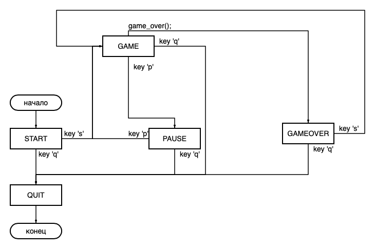

## C7_BrickGame - Tetris

### Документация к проекту

### Управление

- `S and s` - клавиши старта игры

- `Left and Right` - клавиши стрелок для движение фигуры в стороны

- `Down` - клавиша стрелки для движение фигуры вниз

- `Space` - клавиша стрелки для премещения фигуры до конца вниз

- `Up` - клавиша для вращения фигуры

- `P and p` - ставит игру на паузу

- `Q and q` - завершения игры

### Конечный автомат

- **START** - Начальное состояние программы. Программа находится в ожидании нажатия клавиши `S / s` для начала игры. После нажатия создает фигуры и инициализирует переходит в статус **GAME**

- **GAME** - Основная фаза игры. Считывает ввод пользователя. В зависимости от нажатой клавиши происходит одно из действий: движение фигуры вправо, влево или вниз, премещение фигуры до конца вниз, вращение фигуры, переход в статус **PAUSE**. Также перемещает фигуру вниз на одну клетку по истечении задержки, определенной для каждого уровня. При столкновении с нижними клетками фиксирует фигуру на поле. Затем проверяет поле на наличие заполненных линий. Если такие имеются, очищает их, начисляет игроку очки и перемещает всё поле над очищенными линиями на одну клетку за каждую такую линию. (Число начисленных очков зависит от количества очищенных линий). После удаления линий выставляет на верх поля фигуру из окна "NEXT" и генерирует новую фигуру для поля "NEXT". Если при выставлении фигуры на поле происхлдит столконовение с болками на поле, то переходит в статус **GAMEOVER**.

- **GAMEOVER** - Игра окончена. Программа находится в ожидании нажатия клавиши `S / s` для начала новой игры. После нажатия очищает прошлые фигуры, создает новые и переходит в статус **GAME**

- **PAUSE** - Останавливает перемещение фигур. Программа находится в ожидании нажатия клавиши `P / p` для перехода в статус **GAME** и продолжения игры.

- **QUIT** - Состояния выхода из игры. Можно перейти из любой фазы нажатием `Q / q`. Очищает переменные и переходит в главное меню.